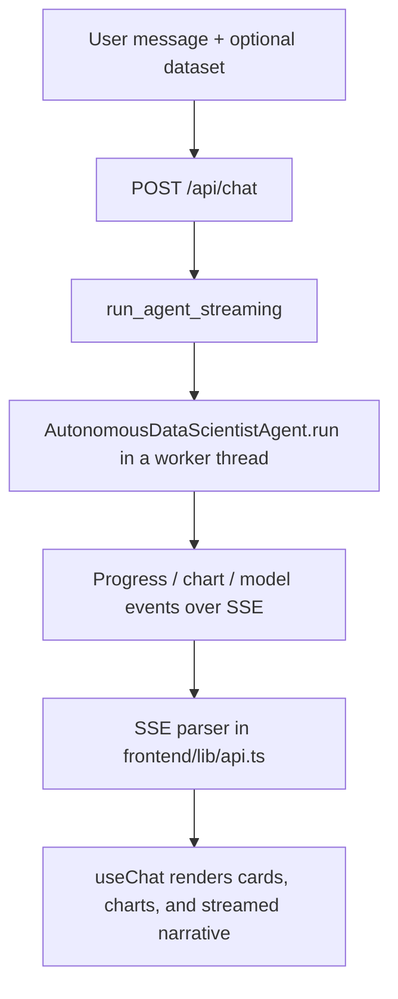

<div align="center">

# 🤖 DataPilot-AI-autonomous-AI-copilot-for-end-to-end-data-science

### Upload a dataset. Say what you want to know. Get a full data-science workflow — explained in plain English.

An autonomous, ChatGPT-style agent that profiles, cleans, explores, models, evaluates, and reports on your data — end to end.


[Features](#-features) · [How It Works](#-how-it-works) · [Quick Start](#-quick-start) · [API](#-api) · [Architecture](#-architecture) · [Security](#-security)

</div>

---

## ✨ Features

- 📂 **Bring any data** — CSV, Excel, JSON, JSONL, Parquet, and Feather
- 🧭 **Fully autonomous pipeline** — profiling → cleaning → EDA → feature engineering → model selection → training → evaluation → report
- 💬 **ChatGPT-style UI** — live progress, dataset cards, model cards, charts, and streamed narrative
- 🧠 **LLM agentic layer** — Claude reviews cleaning strategy and model shortlists, writes the summary, and answers follow-up questions
- 🛟 **Fail-soft by design** — no API key? The pipeline still runs on rule-based logic alone
- 📊 **Automatic EDA** — correlation heatmaps, distributions, boxplots, target and categorical plots
- 🏆 **Model leaderboard** — every candidate is cross-validated and ranked
- 📝 **Downloadable Markdown report** — the full analysis in one file
- 🔒 **Safe by construction** — the LLM never runs code; it only picks from a fixed set of Python tools

## 🔄 How It Works

```
Data Profiling → Cleaning → EDA → Feature Engineering →
Model Selection → Training → Evaluation → Report
```



## 🚀 Quick Start

### 1. Backend (FastAPI)

```bash
cd backend
python -m venv .venv && source .venv/bin/activate   # Windows: .venv\Scripts\activate
pip install -r requirements.txt
cp .env.example .env        # then fill in ANTHROPIC_API_KEY, SECRET_KEY, etc.
uvicorn app.main:app --reload --port 8000
```

SQLite is used by default (`backend/data/agent.db`). For production, set `DATABASE_URL` to a `postgresql://...` URL — the SQLAlchemy layer works unmodified against either.

### 2. Frontend (Next.js)

```bash
cd frontend
npm install
cp .env.local.example .env.local
npm run dev
```

Open **http://localhost:3000** 🎉

In dev, `next.config.mjs` proxies `/api/*` to the backend (`BACKEND_URL`, default `http://localhost:8000`), so no CORS setup is needed. In production, either keep that proxy at your edge/CDN, or set `NEXT_PUBLIC_API_URL` so the frontend calls the backend directly (and configure `CORS_ORIGINS` in the backend `.env`).

### 3. CLI (no UI needed)

```bash
python main.py --csv sample_data/customer_churn.csv --target Churn \
    --objective "Predict customer churn to prioritize retention outreach."
```

### 4. Legacy Streamlit app

```bash
python -m streamlit run legacy_streamlit/app.py
```

Uses the same `agent_core/` package, run from the project root.

## ⚙️ Configuration

| Variable | Purpose |
|---|---|
| `DATABASE_URL` | `sqlite:///./data/agent.db` (dev) or `postgresql://...` (prod) |
| `ANTHROPIC_API_KEY` | Enables LLM-assisted advice, narration, and chat |
| `LLM_MODEL` | Defaults to `claude-sonnet-4-6` |
| `SECRET_KEY` | App secret — generate a real one for production |
| `CORS_ORIGINS` | Comma-separated list of allowed frontend origins |
| `UPLOAD_DIR` / `REPORTS_DIR` | Where datasets and generated reports are stored |
| `MAX_UPLOAD_SIZE_MB` | Upload size limit (default 50 MB) |

See `backend/.env.example` for the full list.

## 🏗️ Architecture

```
frontend/           Next.js + TypeScript + Tailwind — ChatGPT-style UI
backend/            FastAPI — REST + SSE streaming API, SQLAlchemy models
agent_core/         The data-science pipeline (shared by backend and legacy app)
legacy_streamlit/   The original Streamlit prototype, kept runnable
sample_data/        Example dataset for trying the pipeline
```

`agent_core/` is the **single source of truth** for all data-science logic. Neither the FastAPI backend nor the legacy Streamlit app duplicates it — both import it directly.

### Pipeline modules

| Module | Stage |
|---|---|
| `profiler.py` | Profiles rows, columns, types, and missing data; infers classification vs. regression |
| `cleaner.py` | Drops junk columns, imputes missing values, caps outliers |
| `eda.py` | Correlation heatmap, distributions, boxplots, target/categorical plots |
| `feature_engineer.py` | Builds the preprocessing pipeline and train/test split |
| `model_selector.py` | Shortlists candidate models by task type, size, and feature mix |
| `trainer.py` | Cross-validates every candidate and ranks a leaderboard |
| `evaluator.py` | Test-set metrics, confusion matrix / residuals plot |
| `reporter.py` | Assembles the full Markdown report |
| `llm_client.py` | Fail-soft Anthropic API wrapper shared by every LLM feature |
| `llm_advisor.py` | LLM review of cleaning strategy and model shortlist |
| `narrator.py` | LLM-written narrative summary |
| `chat.py` | `DataChatAgent` — grounded follow-up Q&A about a completed run |
| `orchestrator.py` | `AutonomousDataScientistAgent` — chains every stage end to end |

## 🔌 API

| Endpoint | Purpose |
|---|---|
| `POST /api/upload` | Upload a CSV, Excel, JSON, JSONL, Parquet, Feather, or MP4 file. Datasets return metadata + preview; MP4 files are stored as media assets |
| `POST /api/chat` | SSE stream: runs the full pipeline or a follow-up chat turn |
| `GET /api/conversations?session_id=` | List conversations |
| `POST /api/conversations` | Create a conversation |
| `GET /api/conversations/{id}` | Conversation + message history |
| `DELETE /api/conversations/{id}` | Delete a conversation |
| `GET /api/datasets/{id}` | Dataset metadata |
| `GET /api/report/{conversation_id}/download` | Download `report.md` |
| `GET /api/report/{conversation_id}/text` | Report as plain text |
| `GET /api/report/{conversation_id}/status` | Whether a run/report exists |
| `GET /api/media/{conversation_id}/download` | Download the latest uploaded MP4 |

## 🔒 Security

- The LLM **never executes code or shell commands** — it selects from a fixed set of Python tools in `agent_core/`, which perform all computation.
- Uploads are validated by extension and size, stored under a per-conversation UUID directory, and never treated as executable input.
- No API keys are sent to or embedded in frontend code — the Anthropic key lives only in the backend environment.

## 🤝 Contributing

Contributions are welcome! Fork the repo, create a feature branch, and open a pull request. Ideas, bug reports, and new pipeline modules are all appreciated.

## ⭐ Support

If this project helps you, consider giving it a star — it helps others discover it!

---

<div align="center">
Built with FastAPI, Next.js, scikit-learn-style pipelines, and Claude.
</div>
