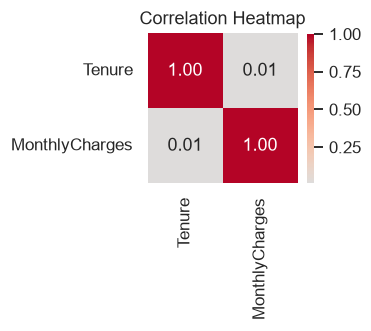
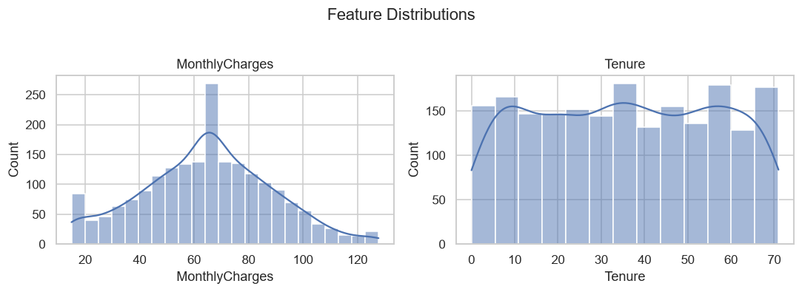
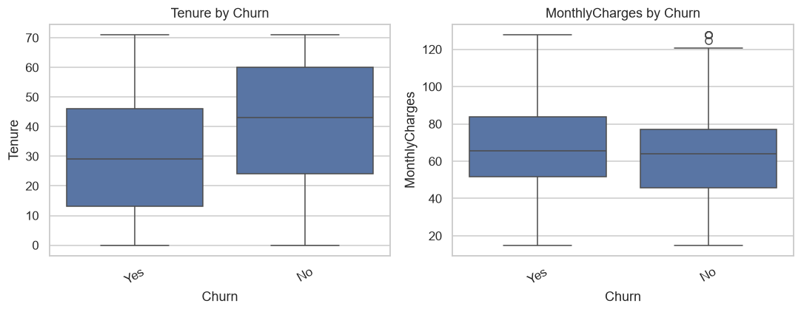
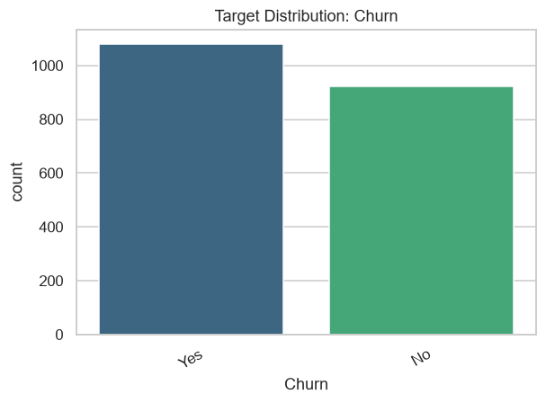
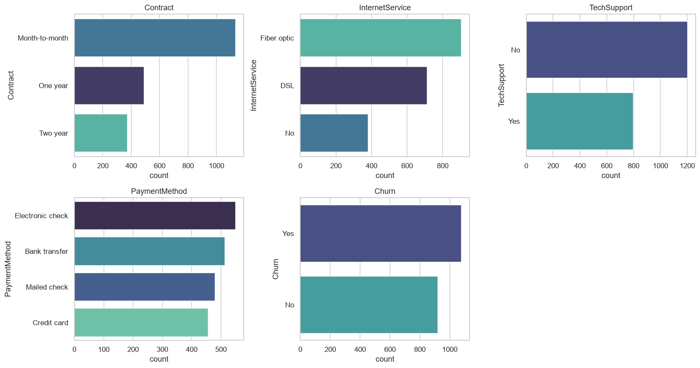
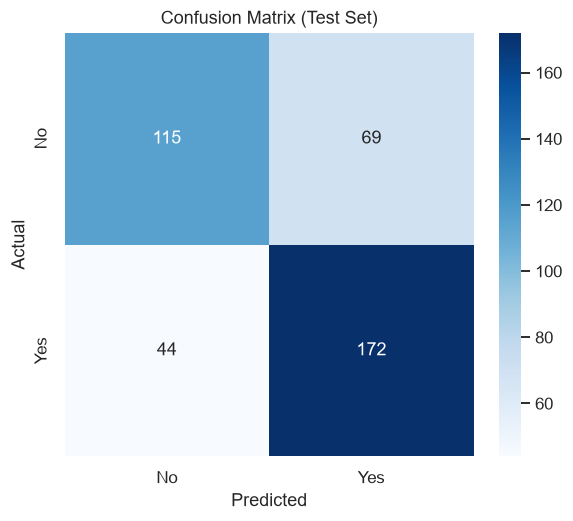

# Autonomous Data Scientist Agent — Report
*Generated 2026-08-31 11:13*

**Dataset:** customer_churn.csv
**Business objective:** Predict customer churn to prioritize retention outreach.

---

## Data Profiling Summary
- Rows: **2000**, Columns: **7**
- Duplicate rows: **0**
- Numeric columns (2): Tenure, MonthlyCharges
- Categorical columns (5): Contract, InternetService, TechSupport, PaymentMethod, Churn
- Datetime columns (0): None
- Detected target column: **Churn** -> task type: **classification**

---

## Data Cleaning Actions
- Dropped 1 constant column(s): ['Country']
- Dropped 1 high-cardinality/identifier column(s): ['CustomerID']
- Removed 1 duplicate row(s)
- Imputed numeric column 'MonthlyCharges' with median (65.220)
- Capped outliers (IQR method) in: ['MonthlyCharges']

---

## Feature Engineering
- Numeric features (2): ['Tenure', 'MonthlyCharges']
- Categorical features (4) one-hot encoded: ['Contract', 'InternetService', 'TechSupport', 'PaymentMethod']
- Label-encoded target classes: ['No', 'Yes']
- Train/test split: 1600 train rows, 400 test rows (test_size=0.2)

---

## Exploratory Data Analysis

---

## Model Selection & Training Leaderboard

| Model | CV Accuracy (mean ± std) | Fit Time (s) |
|---|---|---|
| LogisticRegression | 0.6831 ± 0.0296 | 2.67 |
| SVC | 0.6756 ± 0.0162 | 0.27 |
| KNeighborsClassifier | 0.6619 ± 0.0313 | 1.46 |
| RandomForestClassifier | 0.6556 ± 0.0146 | 2.48 |
| XGBClassifier | 0.6556 ± 0.0130 | 2.13 |

**Selected model:** `LogisticRegression` (highest cross-validated score)

---

## Evaluation Metrics (Test Set)

| Metric | Value |
|---|---|
| accuracy | 0.7175 |
| precision_macro | 0.7185 |
| recall_macro | 0.7106 |
| f1_macro | 0.7116 |

---

## Summary
The agent inspected **customer_churn.csv**, cleaned and transformed the data, explored it visually, trained and compared multiple candidate models, and selected **LogisticRegression** as the best-performing model for the stated business objective. See the metrics and plots above for detail.